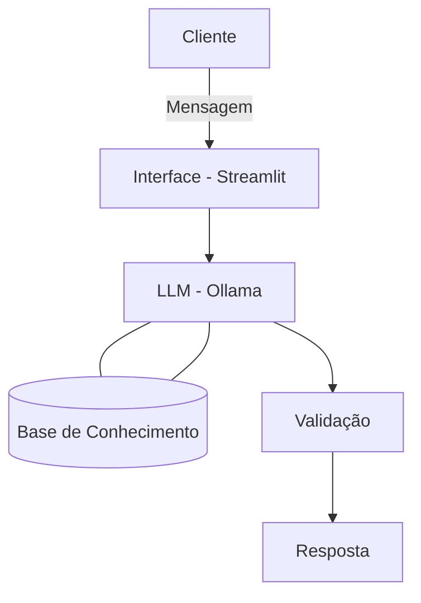

# 🤖 Luma: a Educadora Financeira

## Sobre o projeto

Como parte do Bootcamp da DIO de Gen IA & Dados, foi desenvolvida uma agente de inteligência artificial com viés de educadora financeira.

---

### 1. Sobre a Luma 

> [!TIP]
> Todas as etapas do projeto estão documentadas na pasta `docs`.

- **Caso de Uso:** Sanar dúvidas sobre assuntos financeiros e sobre gastos pessoais do usuário, sem recomendar investimentos
- **Persona e Tom de Voz:** Informal e didática

---

### Arquitetura de funcionamento



### 2. Base de Conhecimento

**Dados mockados** disponíveis na pasta [`data/`](./data/) para alimentar a agente:

| Arquivo | Formato | Descrição |
|---------|---------|-----------|
| `transacoes.csv` | CSV | Histórico de transações do cliente |
| `historico_atendimento.csv` | CSV | Histórico de atendimentos anteriores |
| `perfil_investidor.json` | JSON | Perfil e preferências do cliente |
| `produtos_financeiros.json` | JSON | Produtos e serviços disponíveis |


---

### 3. Prompts do Agente

Foi essencial desenvolver um System Prompr para dar instruções gerais de comportamento da Luma, incluindo regras e limitações (como não disponibilizar informações sensíveis). 


📄 **Dê uma olhada:** [`docs/03-prompts.md`](./docs/03-prompts.md)

---

### 4. Plataformas utilizadas


- Ollama (gemma:2b) - inteligência articial
- VS Code
- Streamlit (interface gráfica)

---

### 5. Avaliação e Métricas

Foram realizados testes para a funcionalidade da Luma e foi observada considerável assertividade, apesar de algumas falhas. 


📄 **Saiba mais em:** [`docs/04-metricas.md`](./docs/04-metricas.md)

---


## Estrutura do Repositório

```
📁 lab-agente-financeiro/
│
├── 📄 README.md
│
├── 📁 data/                          # Dados mockados para o agente
│   ├── historico_atendimento.csv     # Histórico de atendimentos (CSV)
│   ├── perfil_investidor.json        # Perfil do cliente (JSON)
│   ├── produtos_financeiros.json     # Produtos disponíveis (JSON)
│   └── transacoes.csv                # Histórico de transações (CSV)
│
├── 📁 docs/                          # Documentação do projeto
│   ├── 01-documentacao-agente.md     # Caso de uso e arquitetura
│   ├── 02-base-conhecimento.md       # Estratégia de dados
│   ├── 03-prompts.md                 # Engenharia de prompts
│   ├── 04-metricas.md                # Avaliação e métricas
│
├── 📁 src/                           # Código da aplicação
│   └── app.py                        # (exemplo de estrutura)

