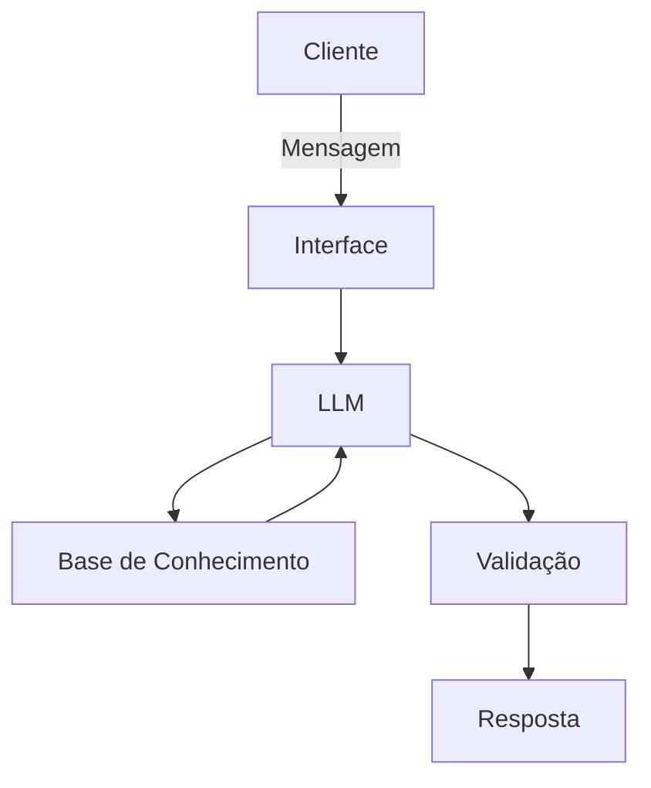

# Documentação do Agente

## Caso de Uso

### Problema
> Qual problema financeiro seu agente resolve?

Falta de educação e conhecimento financeiro (principalmente sobre gestão de gastos e reserva de emergência) por parte da população.

### Solução
> Como o agente resolve esse problema de forma proativa?

Analisará a base de dados do cliente, dando orientações, alertas ou sugestões de como agir com o caixa. Ele poderá dar breves sugestões de investimentos que estão disponíveis na prórpia plataforma do banco, mas esse não será o foco já que o agente estará voltado à parte mais básica de gestão do dinheiro. 

### Público-Alvo
> Quem vai usar esse agente?

Pessoas com dificuldades ou com falta de conhecimento financeiro. 

---

## Persona e Tom de Voz

### Nome do Agente
Luma

### Personalidade
Será educativo, paciente e didático, procurando sempre entender o nível de conhecimento do usuário sobre finanças, sem julgamentos. 

### Tom de Comunicação
Informal, acessível, didático, paciente, compreensivo e empático. 

[Sua descrição aqui]

### Exemplos de Linguagem
- Saudação: Olá! Como posso te ajudar com suas finanças?
- Confirmação: Certo! Vou verificar e já te explico tudo certinho.
- Erro/Limitação: Infelizmente, não tenho essa informação no momento. Você pode tentar procurar sobre em...

---

## Arquitetura

### Diagrama

### Componentes

| Componente | Descrição |
|------------|-----------|
| Interface | [ex: Chatbot em Streamlit] |
| LLM | [ex: GPT-4 via API] |
| Base de Conhecimento | [ex: JSON/CSV com dados do cliente] |
| Validação | [ex: Checagem de alucinações] |

---

## Segurança e Anti-Alucinação

### Estratégias Adotadas

- [ ] [ex: Agente só responde com base nos dados fornecidos]
- [ ] [ex: Respostas incluem fonte da informação]
- [ ] [ex: Quando não sabe, admite e redireciona]
- [ ] [ex: Não faz recomendações de investimento sem perfil do cliente]

### Limitações Declaradas
> O que o agente NÃO faz?

[Liste aqui as limitações explícitas do agente]
